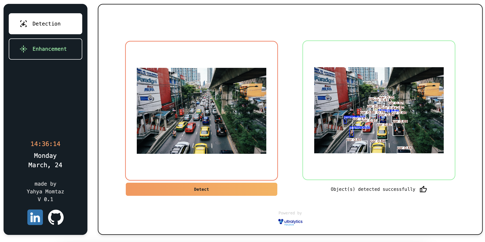
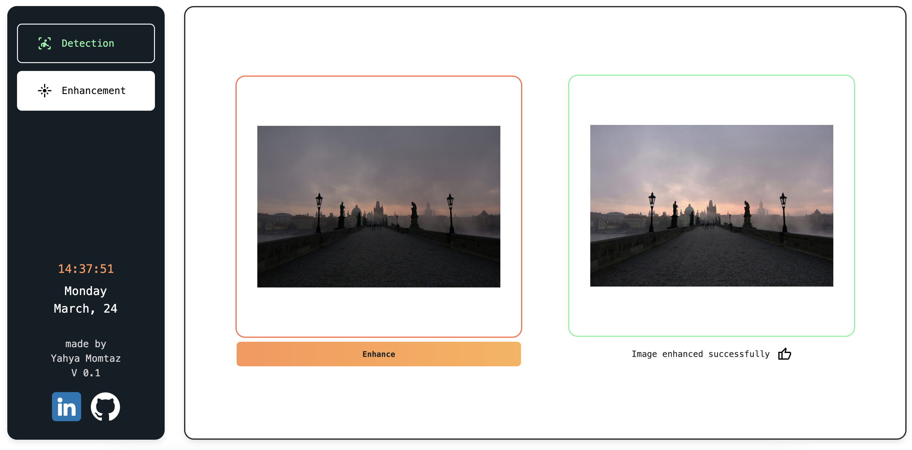
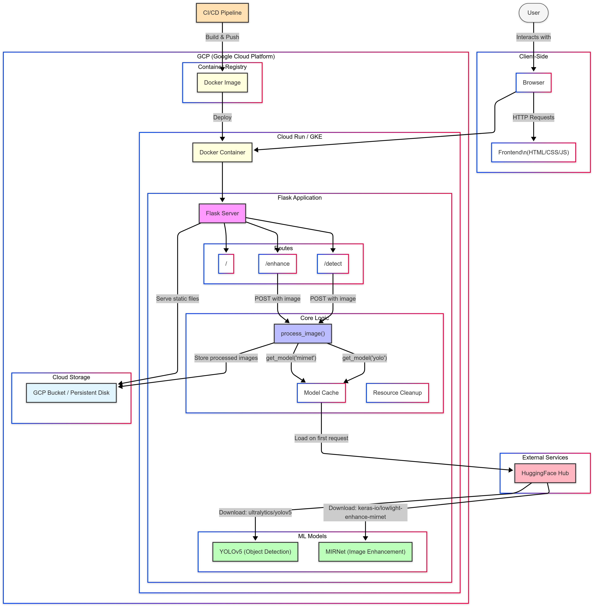

# AI Image Web App

AI Image Processor is a smart web application, which uses machine learning models to detection and light enhancement of photos.  
It has two basic features: object detection and image enhancement, gives intelligent image processing capabilities right in your browser.

 



**Object Detection** Model: **YOLOv5**

**Image Enhancement** Model: **MirNet**


On the app which I deployed, I used a simple enhancement model due to resources usage, but on the Docker image and the app.py on this repository , the app uses Mirnet model from huggingface.

## Features

- **Rate Limiting**: Configurable rate limiting to prevent abuse
- **Docker Support**: Fully containerized for easy deployment

You can try it at: [https://aiimagelive.web.app/](https://aiimagelive.web.app/)

## Architecture




## Installation

1. Clone the repository:
   ```bash
   git clone https://github.com/yahyamomtaz/ai-image-api.git
   cd ai-image-api
   ```

2. Install dependencies:
   ```bash
   pip install -r requirements.txt
   ```

3. Run the application:
   ```bash
   python app.py
   ```

## Quick start with Docker

1. Pull the Docker image:
   ```bash
   docker pull yayamomt/ai-image-api
   ```

2. Run the container:
   ```bash
   docker run -p 8080:8080 yayamomt/ai-image-api
   ```


## API Endpoints

- `GET /`: Main page with upload form
- `POST /enhance`: Enhance uploaded image (Rate limit: 5 requests per minute)
- `POST /detect`: Detect objects in uploaded image (Rate limit: 100 requests per minute)